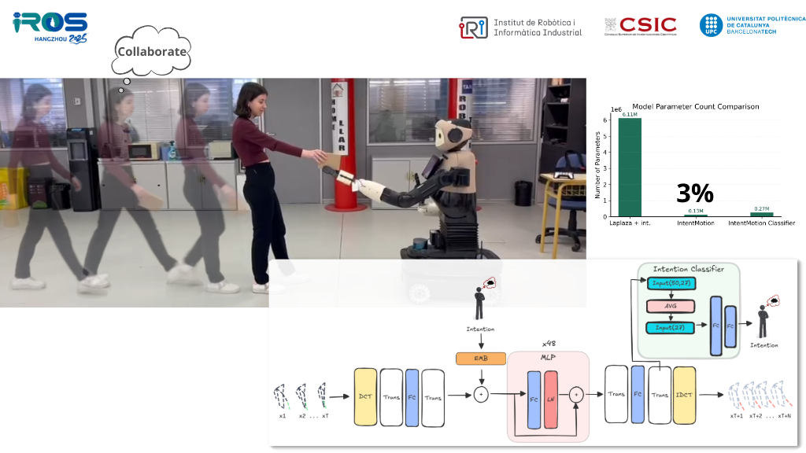
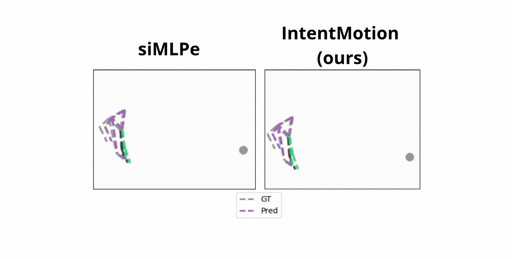

---
# 🤖 IntentMotion: Enhancing Context-Aware Human Motion Prediction for Efficient Robot Handovers

<div align="center">

*Accurate human motion prediction (HMP) is critical for seamless human-robot collaboration, particularly in handover tasks that require real-time adaptability.* 

**[Paper](https://arxiv.org/pdf/2503.00576)** | **[Video Presentation](https://youtu.be/BHQKijZAPQ4)** 

</div>

---

## 🎥 Presentation & Demos

### Video Presentation

*(Click the image below to watch the IROS 2025 presentation video)*

<div align="center">
<a href="https://youtu.be/BHQKijZAPQ4">
  
</a>
</div>

### Motion Prediction Animations

*IntentMotion dynamically adjusts its predictions based on the inferred human intention (collaborative vs. non-collaborative).* 

<div>

<p><em>While the baseline siMLPe model frequently degenerates into static right-hand predictions during object transfer, our intention-aware framework explicitly infers human collaborative intent. This contextual modulation significantly improves the forecasting fidelity of right-hand kinematics, synthesizing fluid and accurate motions essential for seamless human-robot handovers.</em></p>
</div>

---

## 📖 About The Project

This repository contains the official implementation of **IntentMotion**, a framework presented at IROS 2025. Our approach enhances human motion forecasting for handover tasks by leveraging a lightweight MLP-based architecture (siMLPe) and introducing key improvements. 

**Key Contributions:**

* **Intention-Awareness:** Incorporates an intention embedding mechanism and a novel intention classifier to refine motion predictions based on human intent. 


* **High Efficiency:** Achieves 200x faster inference and requires only 3% of the parameters compared to existing state-of-the-art HMP models. 


* **Task-Specific Accuracy:** Reduces body loss error by over 50%. Introduces custom loss terms ($\mathcal{L}_{c}$, $\mathcal{L}_{rer}$, and $\mathcal{L}_{vr}$) to specifically enhance the modeling of right-hand dynamics during handovers. 


### Objective Function

To ensure highly accurate right-hand positioning, IntentMotion optimizes the following multi-term objective function:

$$\mathcal{L}_{h}=\mathcal{L}_{re}+\mathcal{L}_{v}+\mathcal{L}_{c}+\mathcal{L}_{rer}+\mathcal{L}_{vr}$$

---

## 📊 Key Results

IntentMotion provides a highly efficient and scalable solution for real-time human-robot interaction. 

### Computational Efficiency

Compared to previous state-of-the-art methods, IntentMotion drastically reduces computational overhead:

| Model | Mean Inference Time (ms) | # Parameters |
| --- | --- |--------------|
| Laplaza et al. [5] + int. | 3,680.6 | 6,113,782    |
| **IntentMotion (Ours)** | **18.5** | **126,558**  |
| **IntentMotion Classifier** | **18.7** | **265,032**  |

### Prediction Accuracy

Additional to the qualitative improvement of predictions, our final model ($FT+Int+\mathcal{L}_{c}+\mathcal{L}_{vr}+\mathcal{L}_{rer}$) achieves superior joint positioning accuracy, especially for the critical right hand involved in the handover:

| Metric | Body $L_{2}$ (m) | $\le0.20m$ (%) | $\le0.30m$ (%) | Right Hand $L_{2}$ (m) |
| --- | --- | --- | --- | --- |
| siMLPe Baseline [1] | 0.177 | 64.53 | 93.48 | 0.217 |
| **IntentMotion (Ours)** | **0.165** | **70.66** | **98.36** | **0.195** |

---

## ⚙️ Repository Structure

```text
.
├── data/
│   ├── handover_test.txt       # Test subject IDs (S7)
│   └── handover_train.txt      # Training subject IDs (S3, S4, S5, S6, S8, S9, S10)
├── exps/
│   └── baseline_handover/
│       ├── config.py           # Main configuration file
│       ├── config_classifier.py # Configuration for the intention classifier
│       ├── test.py             # Testing and evaluation script
│       └── train.py            # Model training script
└── requirements.txt            # Python dependencies

```

---

## 🚀 Getting Started

### 1. Installation

Clone the repository and install the required dependencies:

```bash
git clone https://github.com/geri06/IROS2025-IntentMotion.git
cd IntentMotion
pip install -r requirements.txt

```

### 2. Configuration

The core settings are managed in `exps/baseline_handover/config.py`.

### 3. Training the Model

To train IntentMotion with the configuration parameters, run:

```bash
CUBLAS_WORKSPACE_CONFIG=:4096:8 python exps/baseline_handover/train_eval_lead_one_out.py \
  --exp-name baseline.txt \
  --seed 888 \
  --layer-norm-axis spatial \
  --with-normalization \
  --num 48

```

*(Note: The `CUBLAS_WORKSPACE_CONFIG=:4096:8` prefix ensures reproducible, deterministic results when using CUDA >= 10.2).*

### 4. Evaluation and Testing

To evaluate a trained model checkpoint and generate metrics (MPJPE, right-hand-specific errors, and intention classification F1-score), run:

```bash
python exps/baseline_handover/test.py \
  --model-pth exps/baseline_handover/log/snapshot/best_model.pth

```

---

## 📝 Citation

If you find this code or our paper useful in your research, please consider citing:

```bibtex
@inproceedings{gomezizquierdo2025intentmotion,
  title={Enhancing Context-Aware Human Motion Prediction for Efficient Robot Handovers},
  author={G{\'o}mez-Izquierdo, Gerard and Laplaza, Javier and Sanfeliu, Alberto and Garrell, Ana{\'\i}s},
  booktitle={IEEE/RSJ International Conference on Intelligent Robots and Systems (IROS)},
  year={2025}
}

@inproceedings{guo2023back,
  title={Back to MLP: A Simple Baseline for Human Motion Prediction},
  author={Guo, Wen and Du, Yuming and Shen, Xi and Lepetit, Vincent and Alameda-Pineda, Xavier and Moreno-Noguer, Francesc},
  booktitle={Proceedings of the IEEE/CVF Winter Conference on Applications of Computer Vision (WACV)},
  pages={4809--4819},
  year={2023}
}
```

---
